## 第一章 函数 极限 连续

## 函数

$$ y = f(x) $$

定义域：$ D_f = D $ 

值域：$ R_f = f(D) = \{ y|y=f(x,x),x\in D \} $

基本要素：定义域，对应法则

#### 常见函数

###### 符号函数

$$ y = \text{sgn}\, x = \begin{cases}
-1, & x < 0, 
0, & x = 0, 
1, & x > 0
\end{cases} $$

##### 取整函数

$$ y = [x] $$

是往下去整的，所以   $ x-1 <[x] \le x $

##### 复合函数

$$ y = f(g(x)) $$

且

$$ D_f \cap R_g \neq \phi $$

##### 反函数
- 定义：设函数$y=f(x)$的定义域为D,值域为$R_y$.若对任意 $y\in R $，有唯一确定的
$x\in D $,使得 $y= f(x)$ 则记为 $x = f^{-1}(y)$ ,称其为函数$y= f(x)$的反函数.

也就是原本一个Y可以对应多个X，现在，一个Y只能对应一个X

 - 单调 $\Rightarrow $ 有反函数
 - 有反函数 $\nRightarrow $ 单调
$$f(x) \Leftrightarrow \forall x_1 \neq x_2 \in D \rightarrow f(x_1) \neq  f(x_2) $$

 - 函数是一 一对应

 - $x = f^{-1}（y）与 y = f^{-1}(x)$是同一个函数

 - 在同一直角坐标系中$y= f(x)$ 和$y=f^{-1}(x)$ 的图形重合;$x= f(y)$ 和$y=f^{-1}(x)$ 的图形关于$y=x$对称 

所以$x = f^{-1}（y）与 y = f^{-1}(x)$函数相同但是图像不同

所以这样理解更好：优先确定f及其反函数是什么对应关系,再依据因变量和自变量代入x和y

e.g. 如$y = f(x) = e^{x}$ 那么$f(x)$的反函数就是 $[\;\;\;] = ln()$ 若为 $y = f^{-1}(x)$ 则为$ y =  ln(x)$ 若为$x = f^{-1}(y)$ 则为$ x =  ln(y)$ 他们都是$f(x)$的反函数

所以反函数的核心在于对应关系相反，而不在于自变量和因变量的换位，因此也与值域定义域范围无关,但可以根据定义域和值域对出现的多结果情况可以进行排除 

反函数和函数的复合是恒等函数
$$ f^{-1}[f(x)] = x \;\; \;\;\;\;f[f^{-1}(x)] = x  $$

## 初等函数

基本初等函数
$$
幂函数\quad y = x^{\mu} \quad (\mu 为实数)；
$$

$$
指数函数\quad y = a^{x} \quad (a > 0, a \neq 1)
$$

$$
对数函数\quad y = \log_{a}x \quad (a > 0, a \neq 1)
$$

$$
三角函数\quad y = \sin x \quad y = \cos x, \quad y = \tan x \quad y = \cot x
$$

$$
反三角函数\quad y = \arcsin x \quad y = \arccos x \quad y = \arctan x 
$$

初等函数：由常数基本初等函数经过有限次的四则运算和有限次的复合所构成的函数

#### 函数的性质
 - 单调性
 - 奇偶性
 - 周期性
 - 有界性

 ## 极限
#### 数列极限

 定义：
 $$\lim_{n \to \infty} x_n = a $$

 $$\forall \varepsilon > 0, \exists N > 0, \text{当 } n > N \text{ 时，恒有 } |x_n - a| < \varepsilon.$$

 

性质：
- 有界性：N之前数列元素有限有最大值最小值，N之后的数列可用区间$[a-\varepsilon,a+\varepsilon]$ 来包括，所以$收敛 \rightarrow 有界$

- 保号性：$a > 0 \rightarrow \exists N > 0,当N>n时\lim_{n \to \infty} x_n > 0 $

数列的极限与前有限项无关，它更关注无限项时的趋势

子列/部分列 ：

- 奇数列和偶数列的极限相同 $\rightarrow$ 源数列的有极限

- 源数列的有极限 $\rightarrow$ 子列也有极限

例题1：

例题2：

- （2）的结论对函数也成立，是一个重要的结论

#### 函数极限

1）自变量趋于无穷大时函数的极限

$$\lim_{x \to +\infty} f(x) = A $$

$$\forall \varepsilon > 0, \exists X > 0, \text{当 } x > X \text{ 时, 恒有 } |f(x) - A| < \varepsilon.$$

$$\lim_{x \to -\infty} f(x) = A $$

$$\forall \varepsilon > 0, \exists X > 0, \text{当 } x < -X \text{ 时, 恒有 } |f(x) - A| < \varepsilon.$$

$$\lim_{x \to \infty} f(x) = A $$

$$\forall \varepsilon > 0, \exists X > 0, \text{当 } |x| > X \text{ 时, 恒有 } |f(x) - A| < \varepsilon.$$

##### 定理1：
$$ \lim_{x \to \infty} f(x) = A \iff \lim_{x \to -\infty} f(x) = \lim_{x \to +\infty} f(x) = A $$

Tips：

$$|x| \to +\infty \iff x \to \infty$$

$$ 数列中n大于0，所以不必带绝对值 $$

2）自变量趋于有限值时函数的极限

$$ \lim_{x \to x_0} f(x) = A $$

$$ \forall \varepsilon > 0, \exists \delta > 0, \text{ 当 } 0 < |x - x_0| < \delta \text{ 时, 恒有 } |f(x) - A| < \varepsilon $$

- 几何意义：
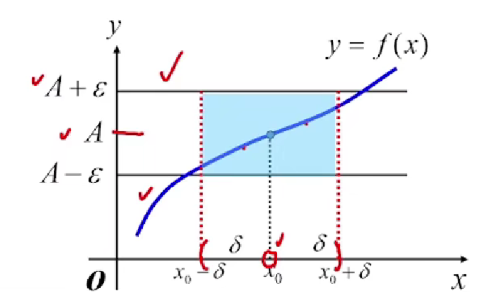

- $ \lim_{x \to x_0} f(x) $ 的值与 $f(x_0)$ 的值无关
- $ x \to x_0, \text{但 } x \neq x_0$

- 要注意极限位置函数无定义时，要写在后面

##### 左、右极限
$$ 左极限：\lim\limits_{x \to x_0^-} f(x) = f(x_0^-) = f(x_0 - 0) $$
$$右极限：\lim\limits_{x \to x_0^+} f(x) = f(x_0^+) = f(x_0 + 0)$$

- $$\lim_{x \to x_0} f(x) = A \Leftrightarrow \lim_{x \to x_0^-} f(x) = \lim_{x \to x_0^+} f(x) = A

需要讨论左右极限的类型
- 分段函数在分界点处的极限
- 注意： $e^\infty$ 型极限 
- 注意： $arctan(\infty)$ 型极限

例题：
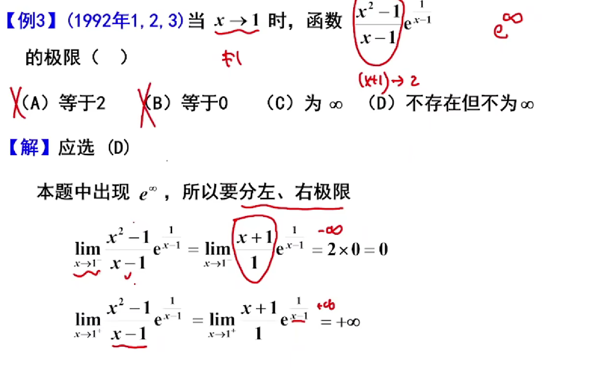
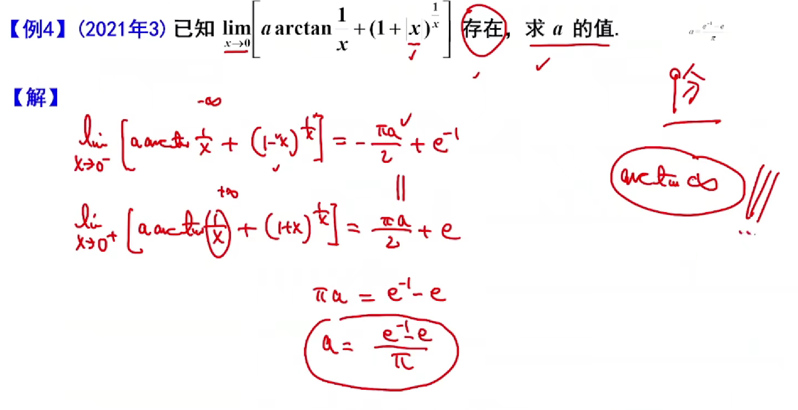

#### 极限的性质
1）有界性
- 数列极限 ： 收敛 $\rightarrow$ 有界;有界 $\nrightarrow$ 收敛

- 函数极限 ： 若$ \lim_{x \to x_0} f(x) $  存在，则$ f(x) $ 有界在$x_0$ 的某去心邻域内有界（局部有界）

2）保号性
- 数列极限 ： 

    1、$如果  A > 0 （或  A < 0 ），则存在  N > 0 ，当  n > N  时， x_n > 0 （或  x_n < 0 ）$

    2、 $ 如果存在  N > 0 ，当  n > N  时， x_n \geq 0 （或  x_n \leq 0 ），则  A \geq 0 （或  A \leq 0 ）。$

    注意二者区别，以及二者带等号的地方

- 函数极限 （区域保号性）： 
    1、$如果  A > 0 （或  A < 0 ），则存在  \delta > 0 ，当  x \in \mathring{U}(x_0, \delta)  时， f(x) > 0 （或  f(x) < 0 ）。$

    2、 $如果存在  \delta > 0 ，当  x \in \mathring{U}(x_0, \delta)  时， f(x) \geq 0 （或  f(x) \leq 0 ），那么  A \geq 0 （或  A \leq 0 ）。$

例题：
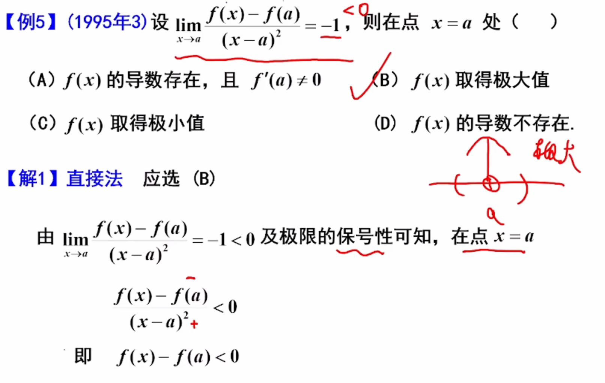
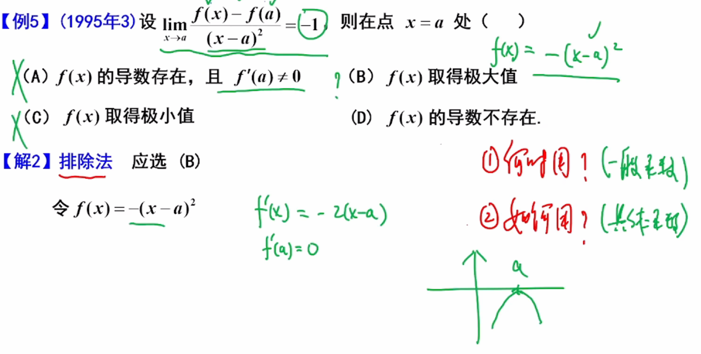

#### 极限存在准则
- 1）夹逼准则：

    若存在 $N$当 $n > N$时，若$x_n \leq y_n \leq z_n$ 且$\lim_{n \to \infty} x_n = \lim_{n \to \infty} z_n = a$
    则$\lim_{n \to \infty} y_n = a$

- 2）单调有界准则

    1、单调增，有上界 $\Rightarrow$ 有极限

    2、单调减，有下界 $\Rightarrow$ 有极限

例题：
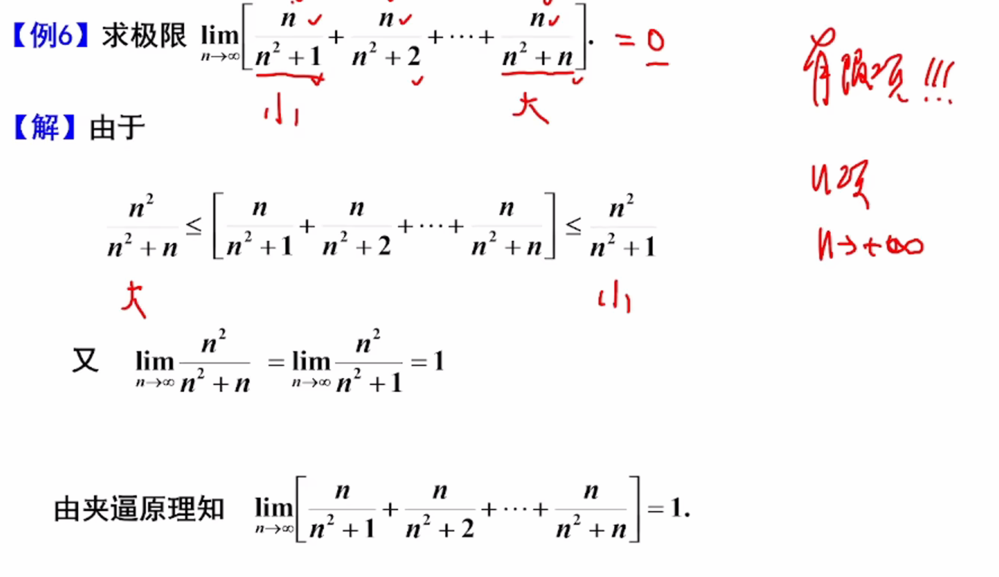

    解题思路：分母都换大或者分母都换小

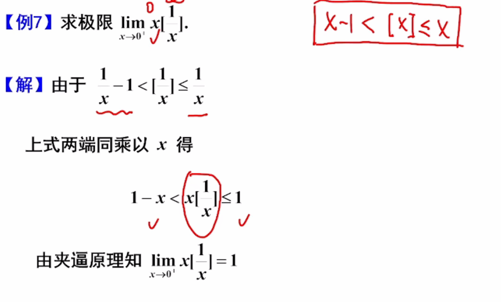

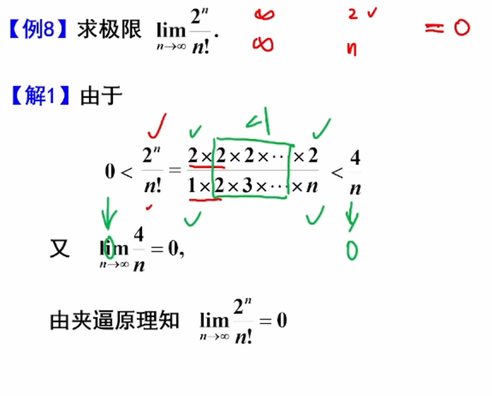

## 无穷小量

#### 定义
- $\textbf{\textcolor{red}{无穷小量的概念}} 若函数  f(x)  当  x \to x_0 （或  x \to \infty ）时的极限为零，则称  f(x)  为  x \to x_0 （或  x \to \infty ）时的无穷小量。$

- $\textbf{\textcolor{red}{2) 无穷小的比较}} 设 \alpha(x) \to 0，\beta(x) \to 0$

     $\textbf{\textcolor{blue}{高阶}}：若 \lim \frac{\alpha(x)}{\beta(x)} = 0；记为 \alpha(x) = o(\beta(x))；$

     $\textbf{\textcolor{blue}{低阶}}：若 \lim \frac{\alpha(x)}{\beta(x)} = \infty；$
    
    $ \textbf{\textcolor{blue}{同阶}}：若 \lim \frac{\alpha(x)}{\beta(x)} = C \neq 0；$

     $\textbf{\textcolor{blue}{等价}}：若 \lim \frac{\alpha(x)}{\beta(x)} = 1；记为 \alpha(x) \sim \beta(x)；$

     $\textbf{\textcolor{blue}{无穷小的阶}}：若 \lim \frac{\alpha(x)}{|\beta(x)|^k} = C \neq 0，称 \alpha(x) 是 \beta(x) 的 k 阶无穷小.$

例题：
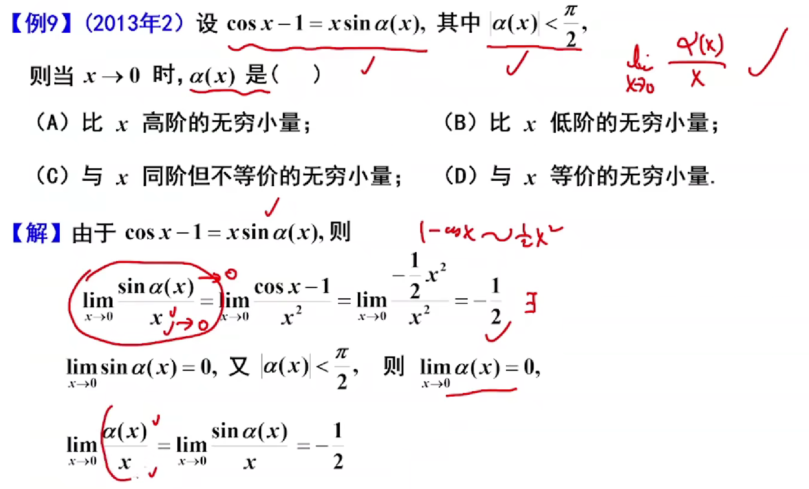

#### 无穷小的性质
- 1）有限个无穷小的和仍是无穷小
- 2）有限个无穷小的积仍是
- 3）无穷小乘以有界量仍是无穷小

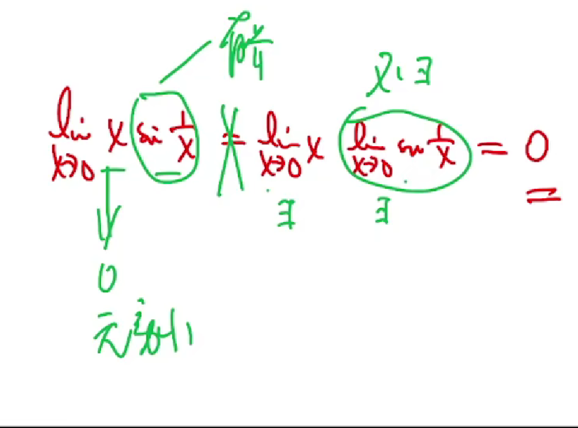

## 无穷大量
$\textbf{\textcolor{red}{1) 无穷大量的概念}}$ 若函数 $f(x)$ 当 $x \to x_0$（或 $x \to \infty$）时趋向于无穷，则称 $f(x)$ 为 $x \to x_0$（或 $x \to \infty$）时的无穷大量。

即：若对任意给定的 $M > 0$，总存在 $\delta > 0$，当 $0 < |x - x_0| < \delta$ 时，恒有 $|f(x)| > M$。

$\textbf{\textcolor{red}{2) 常用的一些无穷大量的比较}}$

$(1) 当  x \to +\infty  时\ln^{\alpha} x \ll x^{\beta} \ll a^{x}其中  \alpha > 0 ， \beta > 0 ， a > 1 。$

$(2) 当  n \to \infty  时\ln^{\alpha} n \ll n^{\beta} \ll a^{n} \ll n! \ll n^{n}其中  \alpha > 0 ， \beta > 0 ， a > 1 。$

#### 无穷大的性质
- 1）有限个无穷大的积仍是
- 2）无穷大与有界的和仍是无穷大

#### 无穷大与无界变量的关系
1）数列 $\{x_n\}$是无穷大量

- $\forall M > 0, \exists N > 0$, 当 $n > N$ 时, 恒有 $|x_n| > M$.

2）数列 $\{x_n\}$是无界变量

- $\forall M > 0, \exists N > 0$，使 $|x_N| > M$. 

无穷大量 $\Rightarrow$ 无界变量

无界变量 $\nRightarrow$ 无穷大量

因为无界变量不要求后面的项都很大，只要有至少一个元素很大

e.g. 数列奇数项无穷大，偶数项为0

## 函数的连续性
#### 连续性的概念

- 定义1 若 $\lim\limits_{\Delta x \to 0} \Delta y = \lim\limits_{\Delta x \to 0} [f(x_0 + \Delta x) - f(x_0)] = 0$，则称 $y = f(x)$ 在点 $x_0$ 处连续。

- 定义2 若 $\lim\limits_{x \to x_0} f(x) = f(x_0)$，则称 $y = f(x)$ 在点 $x_0$ 处连续。

- 定义3 若 $\lim\limits_{x \to x_0^-} f(x) = f(x_0)$，则称 $y = f(x)$ 在点 $x_0$ 处左连续。
 若 $\lim\limits_{x \to x_0^+} f(x) = f(x_0)$，则称 $y = f(x)$ 在点 $x_0$ 处右连续。

- 定理 $f(x)$ 连续 $\iff$ $f(x)$ 左连续且右连续。

#### 间断点及其分类
- 定义 若$f(x)$ 在 $x_0$ 某去心邻域有定义，但在 $x_0$ 处不连续，则称 $x_0$ 为 $f(x)$ 的间断点。
##### 分类
1） 第一类间断点 ：左右极限均存在的间断点
- 可去间断点 ：左极限 = 右极限
- 跳跃间断点 ：左极限 ≠ 右极限

2） 第二类间断点 ：左右极限至少有一个不存在的间断点
- 无穷间断点 ：左极限或右极限为 $\infty$ 或 $-\infty$
- 振荡间断点 ： 始终在震荡, 如$sin(\frac{1}{x})$
- 还有其他种类

##### 连续性的计算和性质
- 定理1 连续函数的和、差、积、商（分母不为零）仍为连续函数；
- 定理2 连续函数的复合仍为连续函数；
- 定理3 基本初等函数在其定义域内是连续；
- 定理4 初等函数在其定义区间内是连续；
- 定理5（有界性定理）： 若函数 $f(x)$ 在闭区间 $[a,b]$ 上连续，则 $f(x)$ 在 $[a,b]$ 上有界；
- 定理6（最值定理）： 若函数 $f(x)$ 在闭区间 $[a,b]$ 上连续，则 $f(x)$ 在 $[a,b]$ 上至少取得一次最大值和最小值；
- 定理7（介值定理）： 若函数 $f(x)$ 在闭区间 $[a,b]$ 上连续，且 $f(a)$ 与 $f(b)$ 异号，则在 $(a,b)$ 内至少存在一点 $c$，使得 $f(c)$可能是区间$[a,b]$函数最大值与最小值之间的任意值。
- $\textbf{\textcolor{red}{定理8（零点定理）}}$： 若函数 $f(x)$ 在闭区间 $[a,b]$ 上连续，且 $f(a) \cdot f(b) < 0$，则 $f(x)$ 在 $(a,b)$ 内至少有一个零点。

## 常考题型与典型例题

### 求极限

- 1) $\textbf{\textcolor{red}{重点：求极限}}$
- 2) $\textbf{\textcolor{red}{难点：极限的概念、性质及存在准则}}$
- 3) 无穷小量阶的比较

####  例题：
例题一：极限存在问题
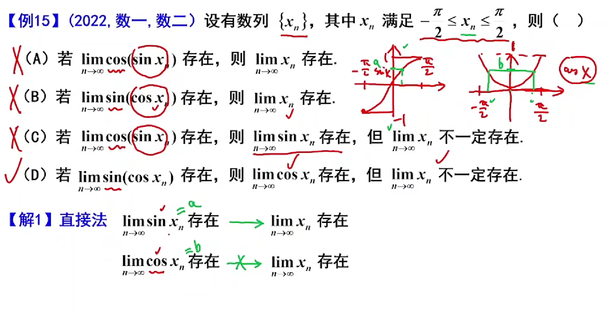

#### 求极限的八种办法

    方法1 利用基本极限求极限

    方法2 利用等价无穷小代换求极限

    方法3 利用有理运算法则求极限

    方法4 利用洛必达法则求极限

    方法5 利用泰勒公式求极限

    方法6 利用夹逼原理求极限

    方法7 利用单调有界准则求极限

    方法8 利用定积分定义求极限

#### 常见的基本极限
$$
\lim\limits_{x \to 0} \frac{\sin x}{x} = 1;
$$

$$
\lim\limits_{x \to 0} (1 + x)^{\frac{1}{x}} = e;
$$

$$
\lim\limits_{x \to \infty} \left(1 + \frac{1}{x}\right)^x = e;
$$

$$
\lim\limits_{x \to 0} \frac{a^x - 1}{x} = \ln a;
$$

$$
\lim\limits_{n \to \infty} \sqrt[n]{n} = 1.
$$

$$
\lim\limits_{n \to \infty} \sqrt[n]{a} = 1,(a > 0),
$$

$$
\lim\limits_{x \to \infty} \frac{a_n x^n + a_{n - 1} x^{n - 1} + \cdots + a_1 x + a_0}{b_m x^m + b_{m - 1} x^{m - 1} + \cdots + b_1 x + b_0} = 
\begin{cases}
\frac{a_n}{b_m}, & n = m, 
0, & n < m, 
\infty, & n > m.
\end{cases}
$$

$$
\lim_{n \to \infty} x^n = 
\begin{cases}
0, & |x| < 1, 
\infty, & |x| > 1, 
1, & x = 1, 
\text{不存在}, & x = -1.
\end{cases}
$$

$$
\lim_{n \to \infty} e^{nx} = 
\begin{cases}
0, & x < 0, 
+\infty, & x > 0, 
1, & x = 0.
\end{cases}
$$

####  "$1^{\infty}$"型极限的常用结论
- 写标准型：$原式 = \lim[1 + \alpha(x)]^{\beta(x)};$

- 求极限 ：$\lim \alpha(x)\beta(x) = A$

- 写结果: 原式 = $e^{A}$

#### 例题：
求极限：
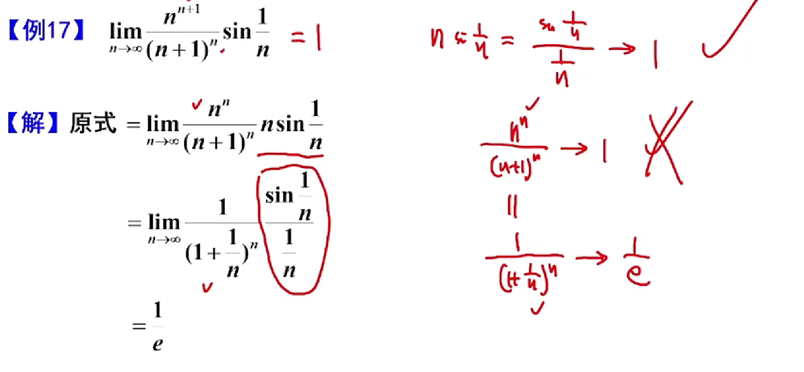
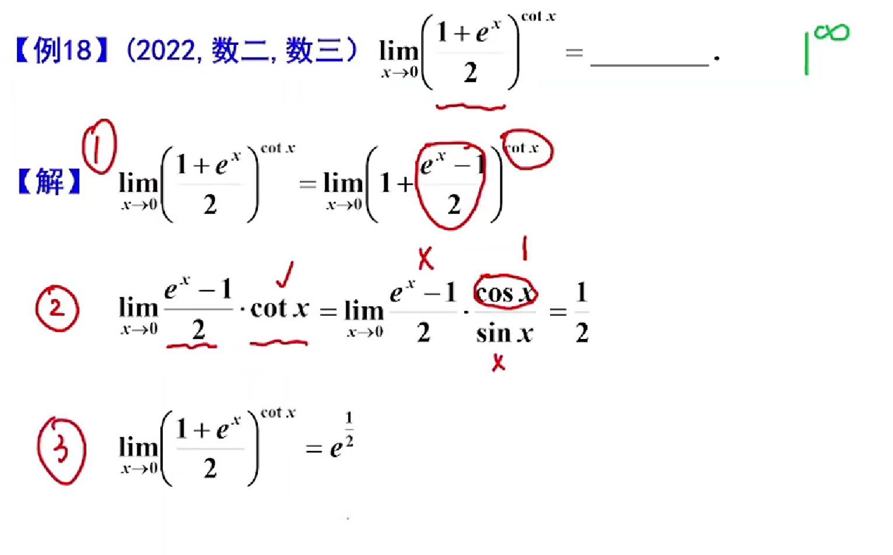
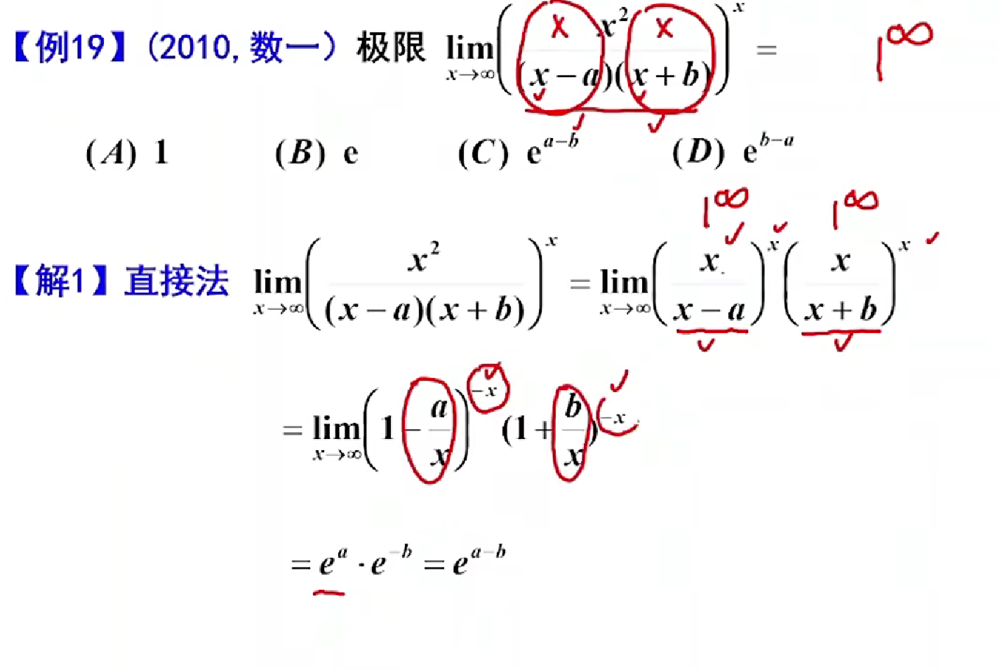
注意把握基本极限
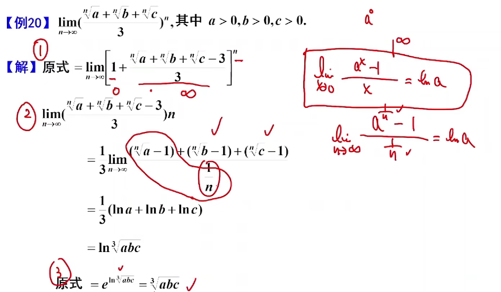

##### 利用等价无穷小代换求极限
（1）代换原则
- a）乘除关系可以换

$$
若 \alpha \sim \alpha_1，\beta \sim \beta_1，则
\lim \frac{\alpha}{\beta} = \lim \frac{\alpha_1}{\beta} = \lim \frac{\alpha}{\beta_1} = \lim \frac{\alpha_1}{\beta_1}
$$
- b）加减在一定条件下可以换

$$
若 \alpha \sim \alpha_1，\beta \sim \beta_1，且 \lim \frac{\alpha_1}{\beta_1} = A \neq 1，则 \alpha - \beta \sim \alpha_1 - \beta_1。
$$

$\textbf{\textcolor{yellow}{即相减的二者不能等价}}$

- **证明**:

$$ \lim \frac{\alpha-\beta}{\alpha_1-\beta_1} = \lim \frac{\beta [\frac{\alpha}{\beta}-1]}{\beta_1 [\frac{\alpha_1}{\beta_1}-1]} = \lim \frac{\beta [A-1]}{\beta_1 [A-1]} = 1
$$

#### 常用等价无穷小
$$ x \sim \sin x \sim \tan x \sim \arcsin x \sim \arctan x \sim \ln(1 + x) \sim e^{x} - 1;$$

$$
a^{x} - 1 \sim x\ln a, \quad (1 + x)^{\alpha} - 1 \sim \alpha x, \quad 1 - \cos x \sim \frac{1}{2}x^{2}
$$

$$\color{red}
x - \sin x \sim \frac{1}{6}x^{3} \qquad \tan x - x \sim \frac{1}{3}x^{3} \qquad  x-ln(1+x) \sim \frac{1}{2}x^{2}
$$

$$\color{red}
\arcsin x - x \sim \frac{1}{6}x^{3} \qquad x - \arctan x \sim \frac{1}{3}x^{3}
$$

联系 ；
$$ \sin(x) \sim x \rightarrow x \sim \arcsin(x) \rightarrow x- \sin(x) \sim arcsin(x)-x
$$

$$ \tan(x) \sim x \rightarrow x \sim \arctan(x) \rightarrow x- \tan(x) \sim arctan(x)-x
$$

例题:

一定要验证 $\color{red}  \lim\limits_{x \to 0} f(x)sin2x = 0$
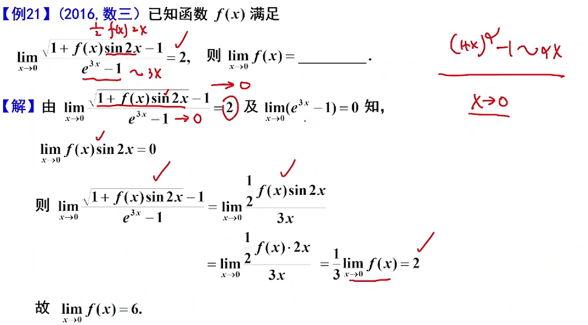

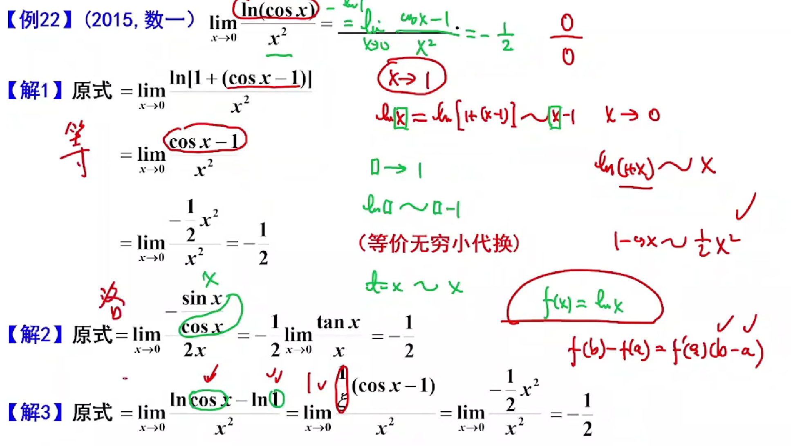

结论
$$ 
x \to 1 \Rightarrow ln(x) \sim x - 1
$$
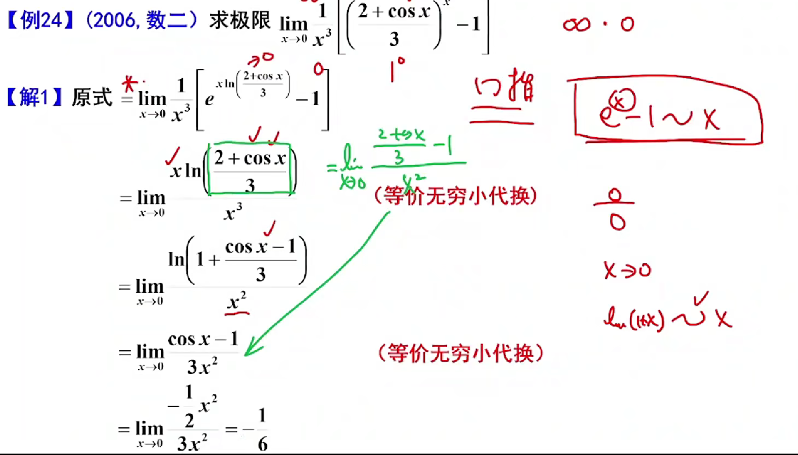

 $\textbf{\textcolor{red}{注意解2答结论}}$

 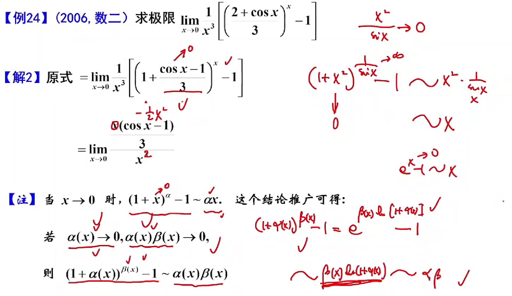

 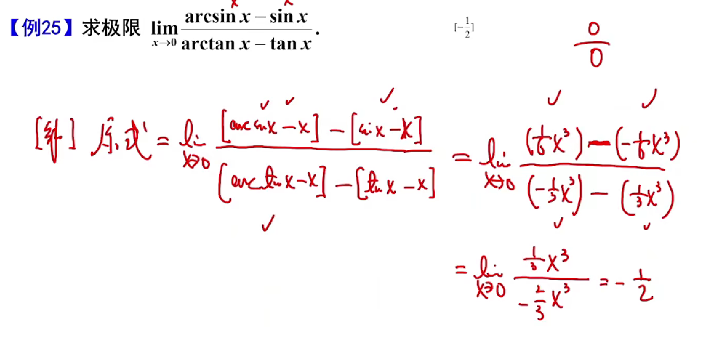

 #### 有理运算法则求极限
 若 $\lim f(x) = A$，$\lim g(x) = B$，那么：

$\lim(f(x) \pm g(x)) = \lim f(x) \pm \lim g(x)$

$\lim(f(x) \cdot g(x)) = \lim f(x) \cdot \lim g(x)$

$\lim\left(\frac{f(x)}{g(x)}\right) = \frac{\lim f(x)}{\lim g(x)} \ (B \neq 0)$

**Tips：**

1）存在$\pm$不存在$=$不存在；

2）不存在$\pm$不存在$=$不一定。

3）存在（非0）$\times\div$不存在$=$不一定；

4）不存在$\times\div$不存在$=$不一定。

##### 常用结论
$$\lim f(x) = A \neq 0 \implies \lim f(x)g(x) = A\lim g(x);$$
 $\textbf{\textcolor{red}{即：极限非零的因子的极限可以先求出来}}$

$$  \lim \frac{f(x)}{g(x)}存在，\lim g(x) = 0 \implies \lim f(x) = 0;$$
$$\lim \frac{f(x)}{g(x)} = A \neq 0, \lim f(x) = 0 \implies \lim g(x) = 0;$$

例题
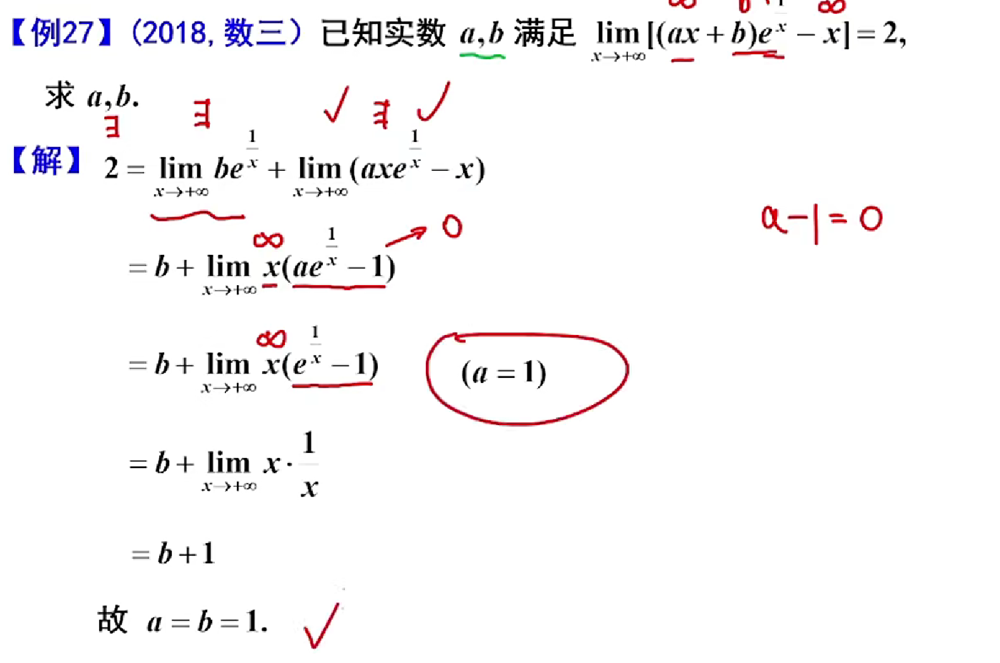
 $\textbf{\textcolor{yellow}{核心思想：利用tips1对极限的存在进行判断}}$

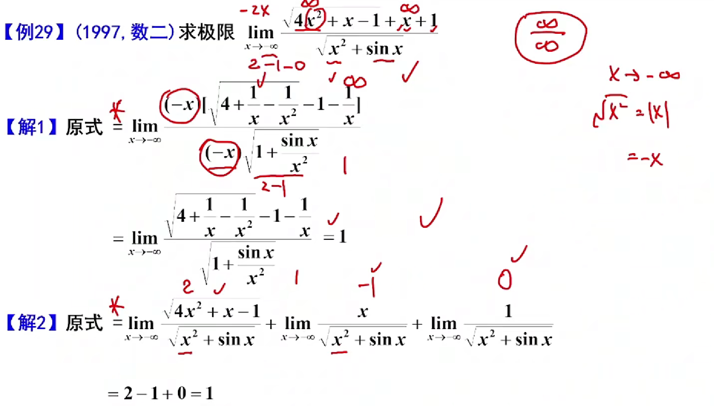

#### 利用洛必达法则求极限
若
1）$\lim\limits_{x \to x_0} f(x) = \lim\limits_{x \to x_0} g(x) = 0 \ (\infty)$；

2）$f(x)$ 和 $g(x)$ 在 $x_0$ 的某去心邻域内可导，且 $g'(x) \neq 0$；

3）$\lim\limits_{x \to x_0} \frac{f'(x)}{g'(x)}$ 存在（或 $\infty$）；

则 $\lim\limits_{x \to x_0} \frac{f(x)}{g(x)} = \lim\limits_{x \to x_0} \frac{f'(x)}{g'(x)}$。

注：1）$$适用类型 \frac{0}{0}；\frac{\infty}{\infty}；0 \cdot \infty；\infty - \infty；1^{\infty}；\infty^{0}；0^{0}。$$

2） 解题思路
$$
 \frac{0}{0},\frac{\infty}{\infty} \Leftarrow \begin{cases} 0 \cdot \infty  \infty - \infty \end{cases} \Leftarrow \begin{cases} 1^{\infty}  \infty^{0}  0^{0} \end{cases}
 $$

tips:$1^{\infty}$时 不如 [三步法](#three_step)

例题：

 $\textbf{\textcolor{red}{可导不一定极限}}$
 对抽象函数的洛必达法则，已知n阶导数，只能用到n-1阶，除非说明n阶导数连续
 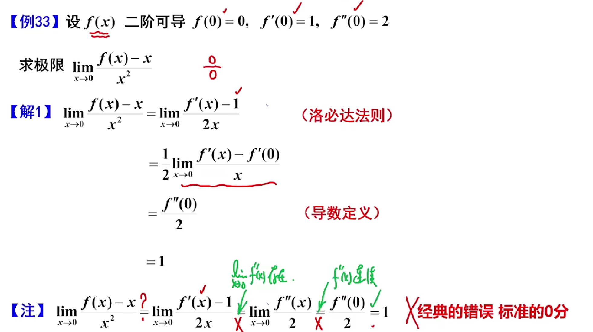

 #### 利用泰勒公式求极限
泰勒公式：设$f(x)$在$x=x_0$处n阶可导，则
$$f(x) = f(x_0) + f'(x_0)(x - x_0) + \frac{f''(x_0)}{2!}(x - x_0)^2 + \cdots + \frac{f^{(n)}(x_0)}{n!}(x - x_0)^n + R_n(x)$$
其中 $R_n(x)$ 为余项。

几个常见公式泰勒公式

$$
 e^x = 1 + x + \frac{x^2}{2!} + \cdots + \frac{x^n}{n!} + o(x^n) 
 $$ 

$$
 \sin x = x - \frac{x^3}{3!} + \cdots + (-1)^{n - 1}\frac{x^{2n - 1}}{(2n - 1)!} + o(x^{2n}) 
$$ 

$$
 \cos x = 1 - \frac{x^2}{2!} + \cdots + (-1)^n\frac{x^{2n}}{(2n)!} + o(x^{2n}) 
$$ 

$$ 
\ln(1 + x) = x - \frac{x^2}{2} + \cdots + (-1)^{n - 1}\frac{x^n}{n} + o(x^n) 
$$

$$ 
(1 + x)^\alpha = 1 + \alpha x + \frac{\alpha(\alpha - 1)}{2!}x^2 + \cdots + \frac{\alpha(\alpha - 1)\cdots(\alpha - n + 1)}{n!}x^n + o(x^n)
$$

补充
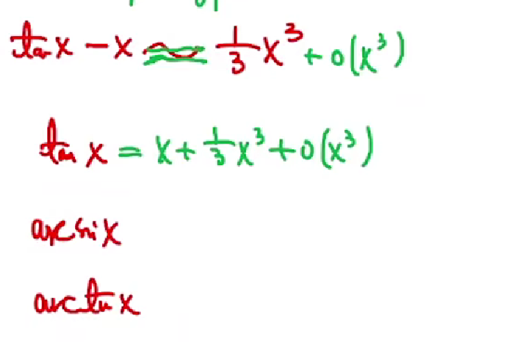
例题：
最低次幂原则
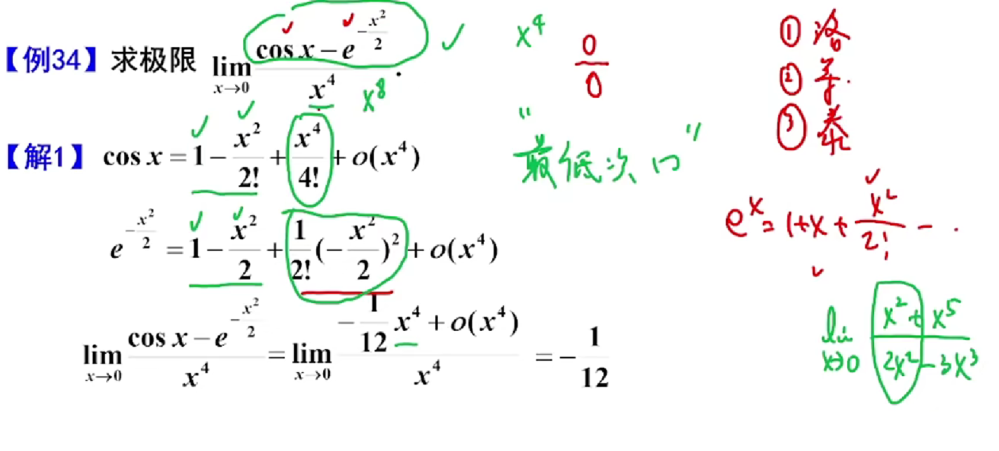
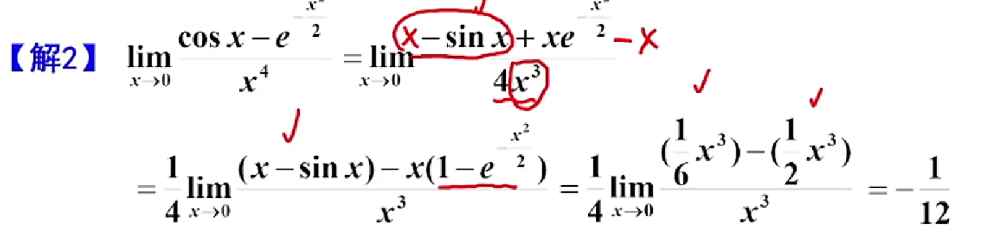
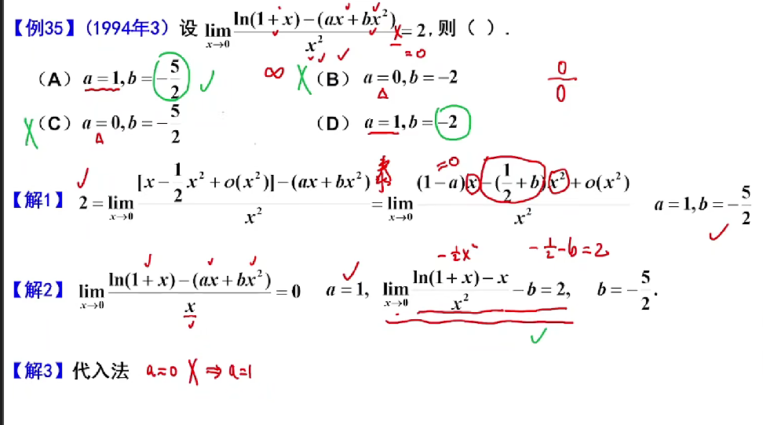 
一般思想：
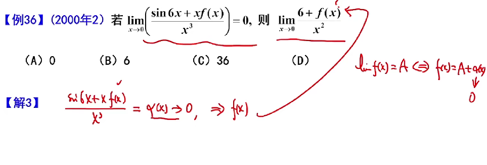

#### 利用夹逼原理求极限
例题：

 $\textbf{\textcolor{red}{常用结论：m个n次方数的和的n次根方的n趋于无穷的极限为底数最大的那一项}}$

  $\textbf{\textcolor{red}{（常数可以拆解为重数相加，即多个1的n次方和，底数视为1）}}$

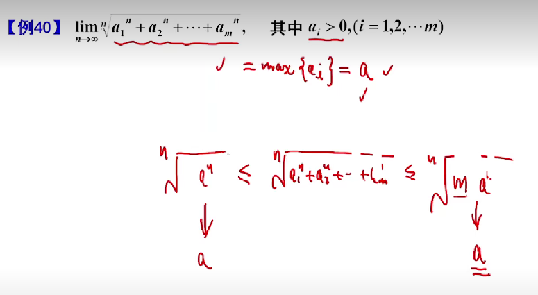
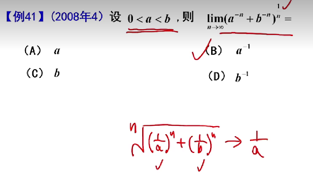
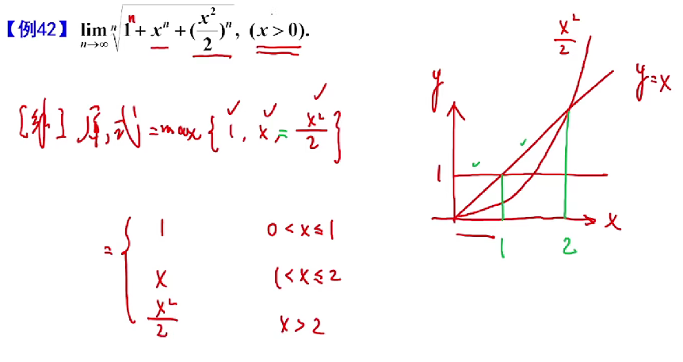

#### 利用单调有界准则求极限
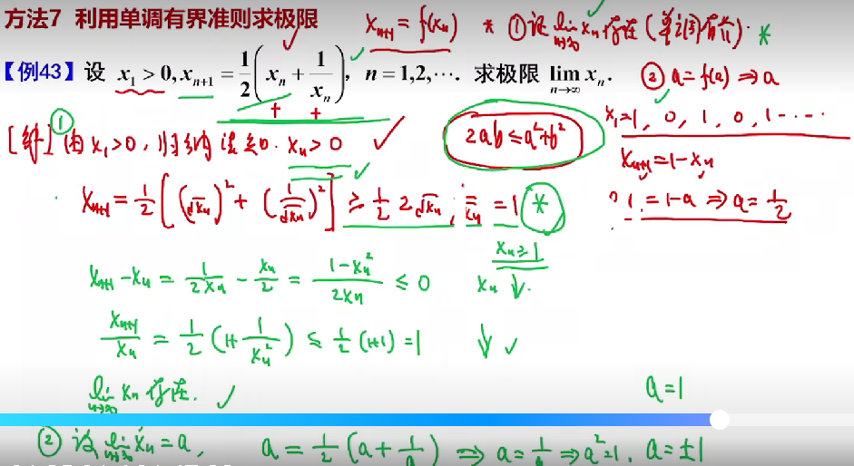

#### 利用定积分定义求极限
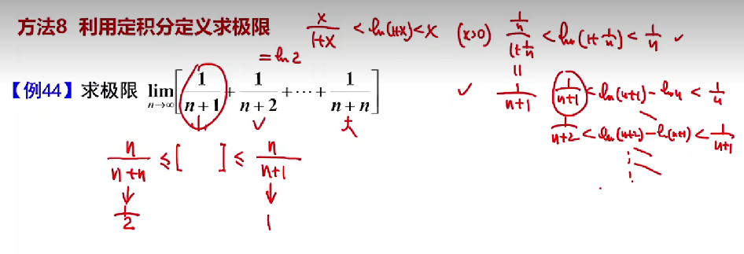(夹逼原理)
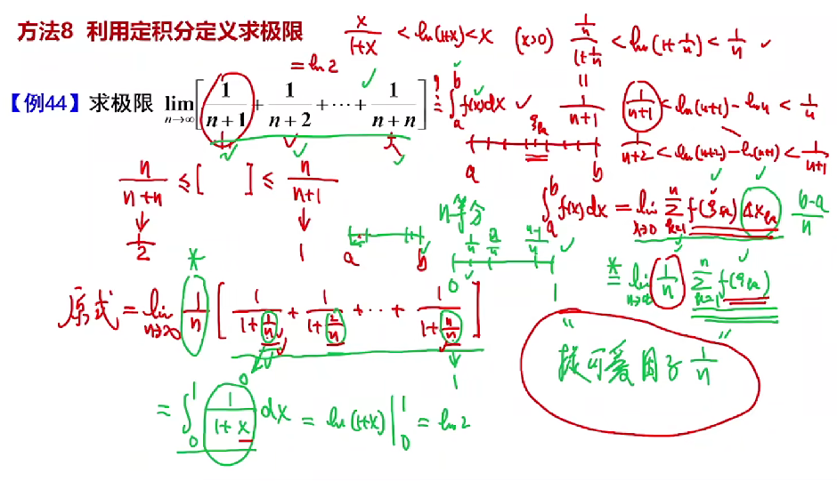
 $\textbf{\textcolor{red}{定积分求极限的一般步骤：}}$
- 提可爱因子：$\frac{1}{n}$
- 确定被积函数：哪里变，哪里就是变量
- 确定积分区间：下限：第一位的极限，上限：最后一位的极限
- 写出定积分表达式，计算定积分

### 函数的连续性
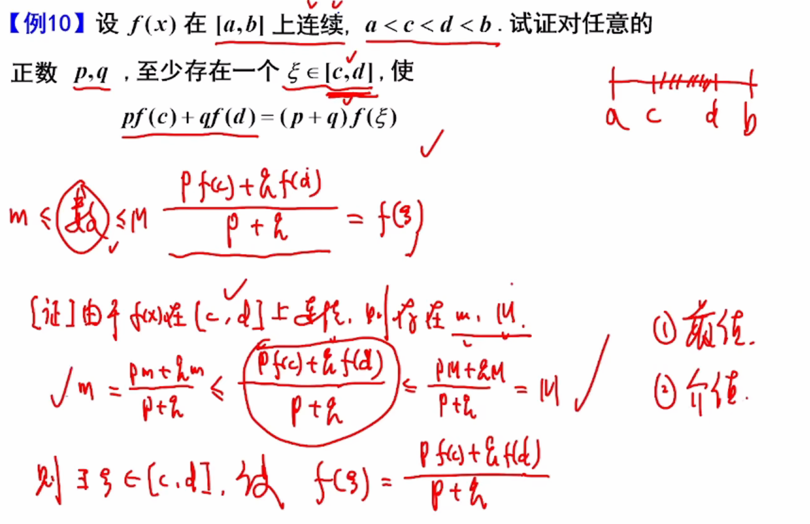

#### 总结：
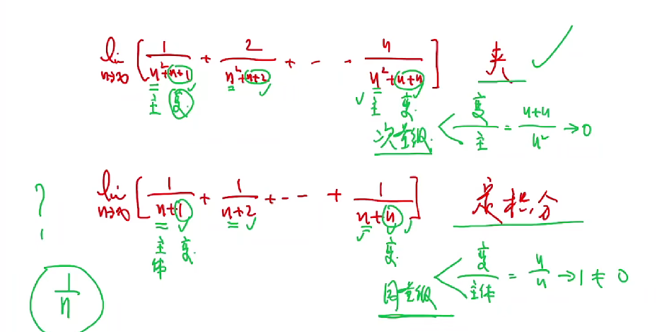
n项和的极限：
- 次量级 $\rightarrow$ 夹逼
- 同量级 $\rightarrow$ 定积分的定义

### 无穷小量阶的比较
等价代换思想：
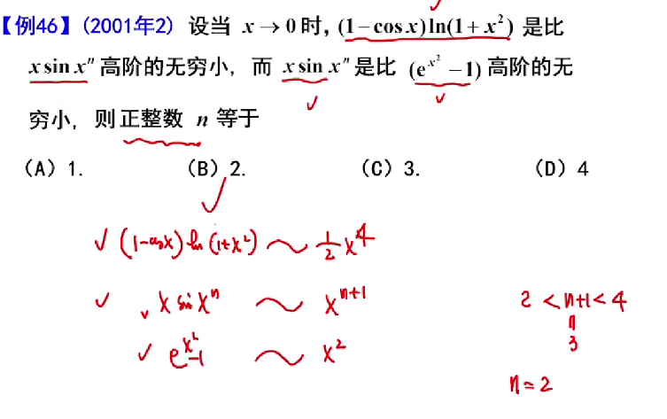
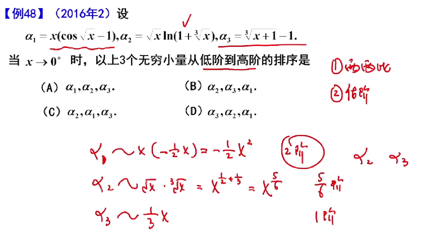

### 函数的连续性
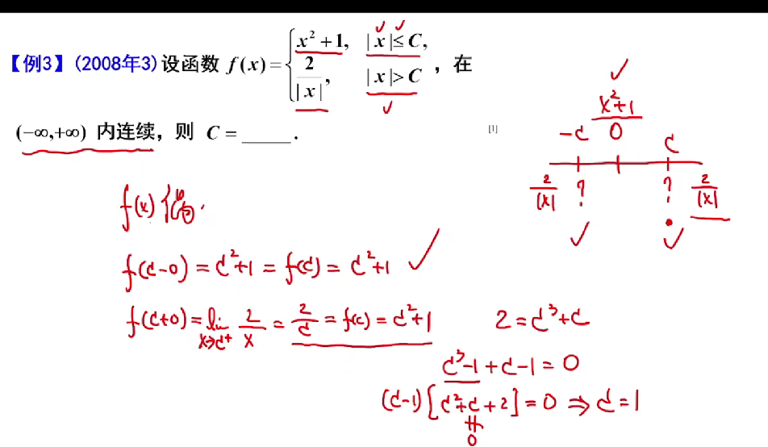