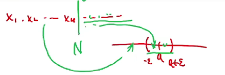
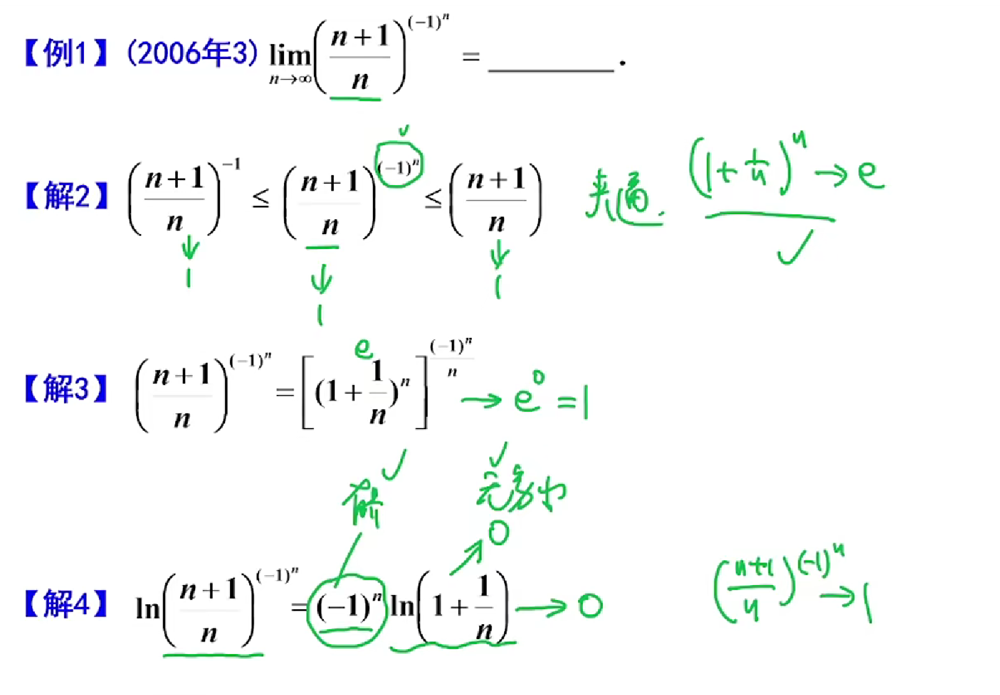
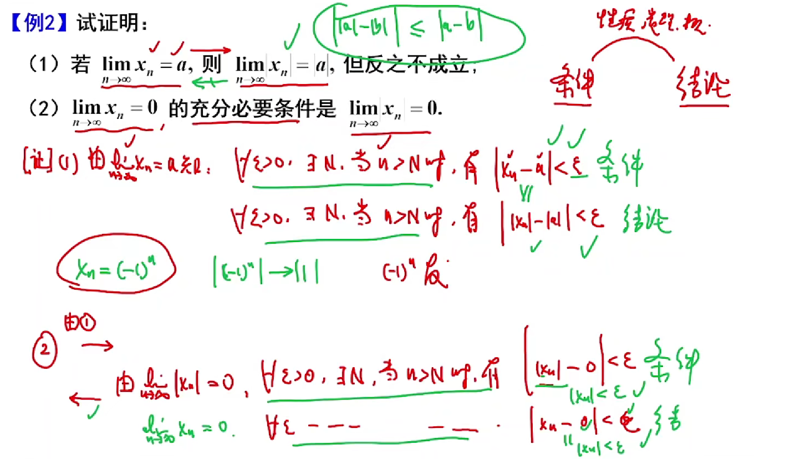

## 第一章 函数 极限 连续

## 函数

$$ y = f(x) $$

定义域：$ D_f = D $ 

值域：$ R_f = f(D) = \{ y|y=f(x,x),x\in D \} $

基本要素：定义域，对应法则

#### 常见函数

###### 符号函数

$$ y = \text{sgn}\, x = \begin{cases}
-1, & x < 0, \\
0, & x = 0, \\
1, & x > 0
\end{cases} $$

##### 取整函数

$$ y = [x] $$

是往下去整的，所以   $ x-1 <[x] \le x $

##### 复合函数

$$ y = f(g(x)) $$

且

$$ D_f \cap R_g \neq \phi $$

##### 反函数
- 定义：设函数$y=f(x)$的定义域为D,值域为$R_y$.若对任意 $y\in R $，有唯一确定的
$x\in D $,使得 $y= f(x)$ 则记为 $x = f^{-1}(y)$ ,称其为函数$y= f(x)$的反函数.

也就是原本一个Y可以对应多个X，现在，一个Y只能对应一个X

 - 单调 $\Rightarrow $ 有反函数
 - 有反函数 $\nRightarrow $ 单调
$$f(x) \Leftrightarrow \forall x_1 \neq x_2 \in D \rightarrow f(x_1) \neq  f(x_2) $$

 - 函数是一 一对应

 - $x = f^{-1}（y）与 y = f^{-1}(x)$是同一个函数

 - 在同一直角坐标系中$y= f(x)$ 和$y=f^{-1}(x)$ 的图形重合;$x= f(y)$ 和$y=f^{-1}(x)$ 的图形关于$y=x$对称 

所以$x = f^{-1}（y）与 y = f^{-1}(x)$函数相同但是图像不同

所以这样理解更好：优先确定f及其反函数是什么对应关系,再依据因变量和自变量代入x和y

e.g. 如$y = f(x) = e^{x}$ 那么$f(x)$的反函数就是 $[\;\;\;] = ln()$ 若为 $y = f^{-1}(x)$ 则为$ y =  ln(x)$ 若为$x = f^{-1}(y)$ 则为$ x =  ln(y)$ 他们都是$f(x)$的反函数

所以反函数的核心在于对应关系相反，而不在于自变量和因变量的换位，因此也与值域定义域范围无关,但可以根据定义域和值域对出现的多结果情况可以进行排除 

反函数和函数的复合是恒等函数
$$ f^{-1}[f(x)] = x \;\; \;\;\;\;f[f^{-1}(x)] = x  $$

## 初等函数

基本初等函数
$$
幂函数\quad y = x^{\mu} \quad (\mu 为实数)；
$$

$$
指数函数\quad y = a^{x} \quad (a > 0, a \neq 1)
$$

$$
对数函数\quad y = \log_{a}x \quad (a > 0, a \neq 1)
$$

$$
三角函数\quad y = \sin x \quad y = \cos x, \quad y = \tan x \quad y = \cot x
$$

$$
反三角函数\quad y = \arcsin x \quad y = \arccos x \quad y = \arctan x 
$$

初等函数：由常数基本初等函数经过有限次的四则运算和有限次的复合所构成的函数

#### 函数的性质
 - 单调性
 - 奇偶性
 - 周期性
 - 有界性

 ## 极限
#### 数列极限

 定义：
 $$\lim_{n \to \infty} x_n = a $$

 $$\forall \varepsilon > 0, \exists N > 0, \text{当 } n > N \text{ 时，恒有 } |x_n - a| < \varepsilon.$$

 

性质：
- 有界性：N之前数列元素有限有最大值最小值，N之后的数列可用区间$[a-\varepsilon,a+\varepsilon]$ 来包括，所以$收敛 \rightarrow 有界$

- 保号性：$a > 0 \rightarrow \exists N > 0,当N>n时\lim_{n \to \infty} x_n > 0 $

数列的极限与前有限项无关，它更关注无限项时的趋势

子列/部分列 ：

- 奇数列和偶数列的极限相同 $\rightarrow$ 源数列的有极限

- 源数列的有极限 $\rightarrow$ 子列也有极限

例题1：

例题2：

- （2）的结论对函数也成立，是一个重要的结论