## 导数与微分

### 导数的概念

定义：
$$
\lim_{\Delta x \to 0} \frac{\Delta y}{\Delta x} = \lim_{\Delta x \to 0} \frac{f(x_0 + \Delta x) - f(x_0)}{\Delta x}
$$

$$
f'(x_0) = \lim_{x \to x_0} \frac{f(x) - f(x_0)}{x - x_0}
$$

左导数
$$
\lim_{\Delta x \to 0^-} \frac{\Delta y}{\Delta x} = \lim_{\Delta x \to 0^-} \frac{f(x_0 + \Delta x) - f(x_0)}{\Delta x}
$$
右导数
$$
\lim_{\Delta x \to 0^+} \frac{\Delta y}{\Delta x} = \lim_{\Delta x \to 0^+} \frac{f(x_0 + \Delta x) - f(x_0)}{\Delta x}
$$

定理1： 可导 $\iff$ 左右导数存在且相等

例题：
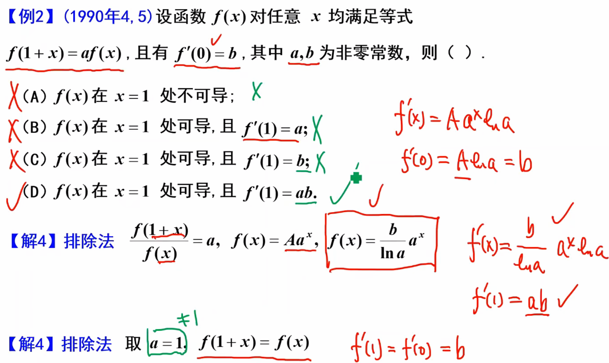

### 微分的概念

$\textcolor{red}{定义5（微分）} $如果 $\Delta y = f(x_0 + \Delta x) - f(x_0)$ 可以表示为
$$
\Delta y = A\Delta x + o(\Delta x) \quad (\Delta x \to 0)
$$
则称函数$f(x)$在$x_0$处可微

$\textcolor{red}{定理}$ 函数$y=f(x)$ 在点$x_0$处可微的充分必要条件是$f(x)$在点$x_0$处可导。且有
$\mathrm{d}y = f'(x_0)\Delta x = f'(x_0)\mathrm{d}x$.

例题:
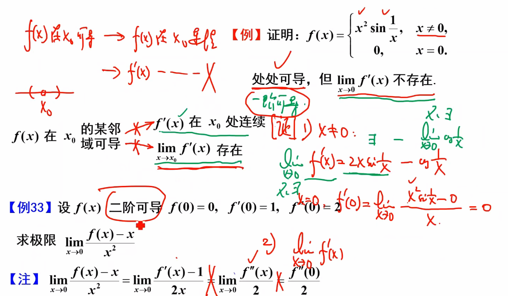
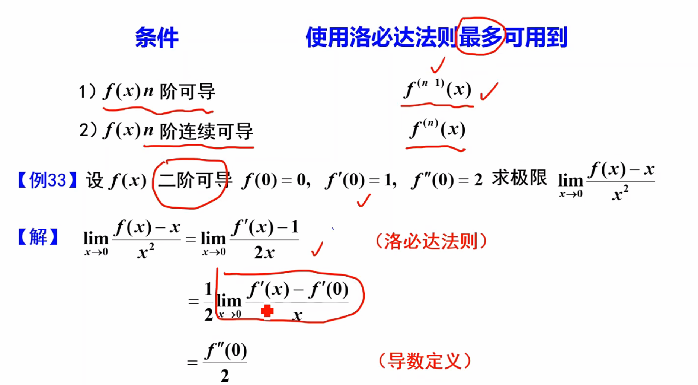

常见函数导数
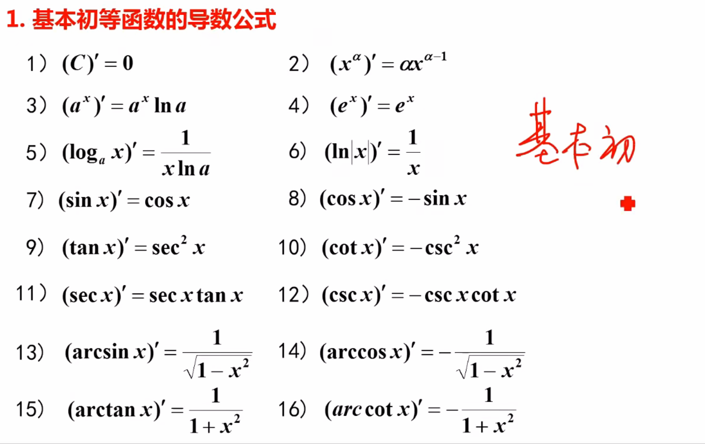

#### 求导法则
##### 有理运算法则
1) $(u \pm v)' = u' \pm v'$

2) $(uv)' = u'v + uv'$

3) $\left( \frac{u}{v} \right)' = \frac{u'v - uv'}{v^2} \quad (v \neq 0)$

##### 复合函数求导法则
$$\frac{dy}{dx} = \frac{dy}{du} \cdot \frac{du}{dx} = f'(u)\varphi'(x)$$

例题（性质）
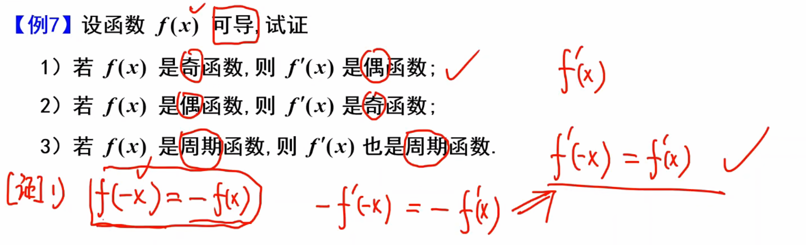

##### 隐函数求导法则
$$ F(x,y) = 0$$ $$\frac{dy}{dx} = -\frac{F_x}{F_y}$$
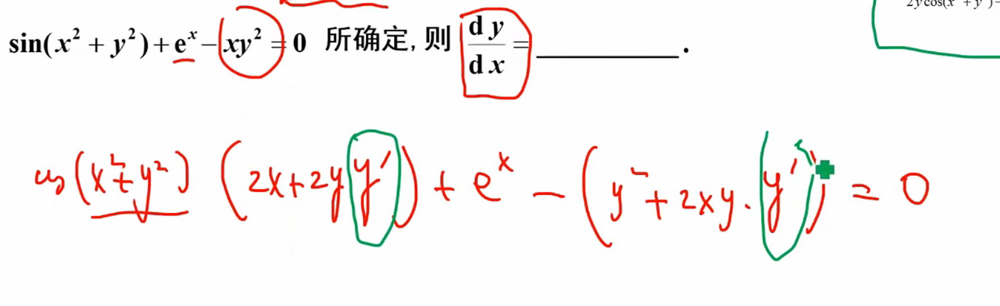

等式两边求解，解出$y'$

##### 反函数的导数
$$\varphi'(y) = \frac{1}{f'(x)}$$

反函数的的导数和原函数的导数本质上是同一个直线（几何上）
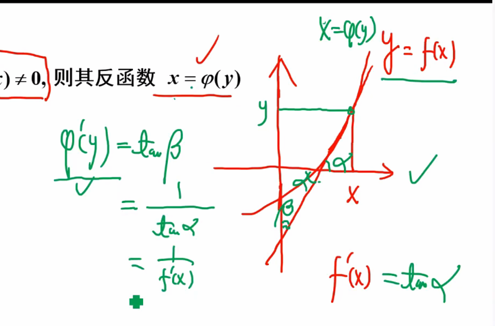

##### 参数方程求导
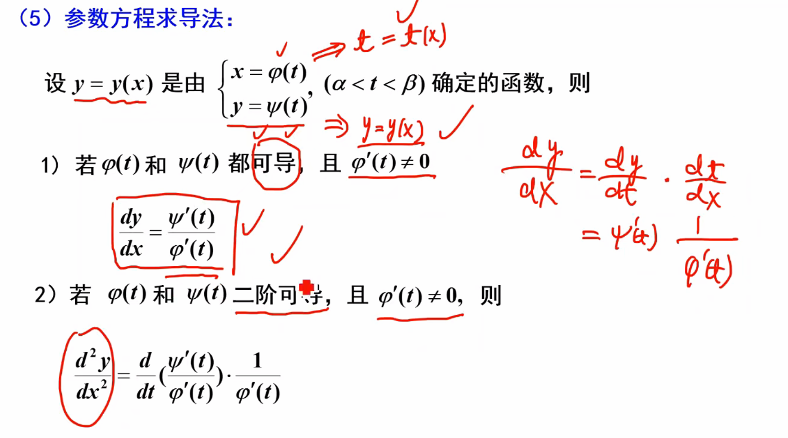
例题：
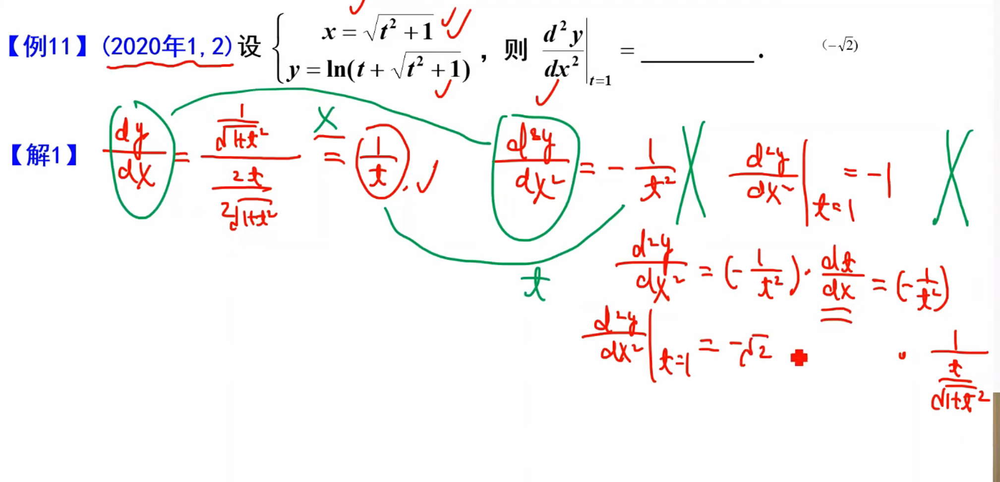

##### 对数求导法 
例题：适合幂指函数，连乘连除开根
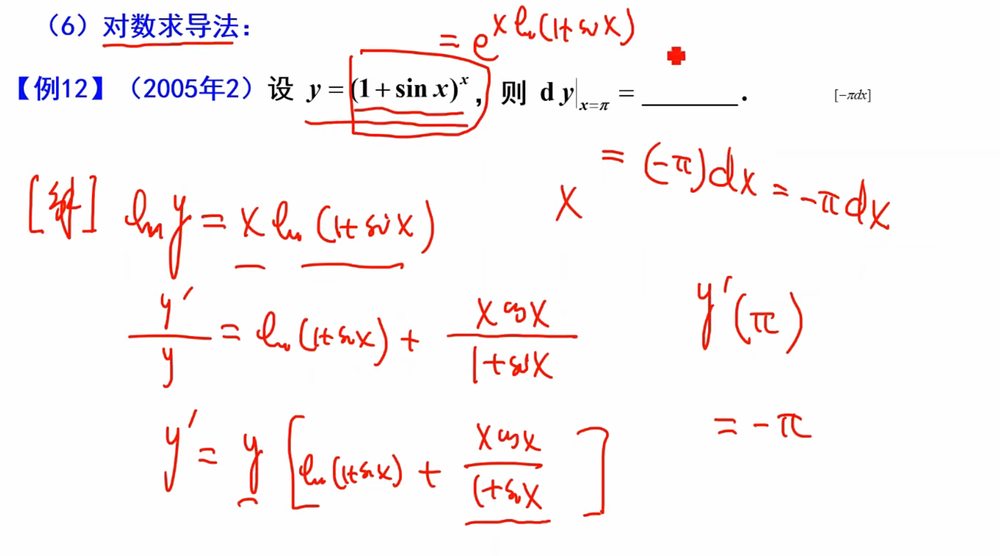
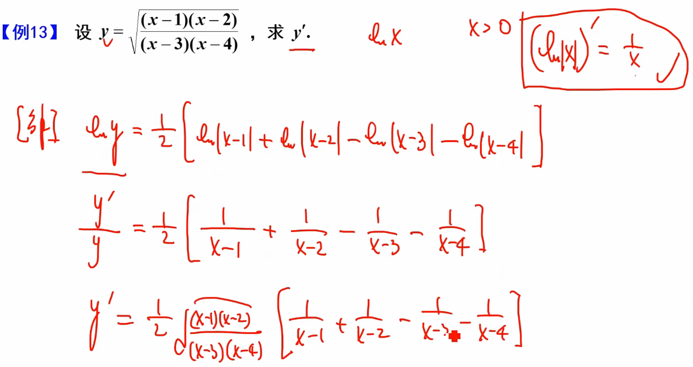